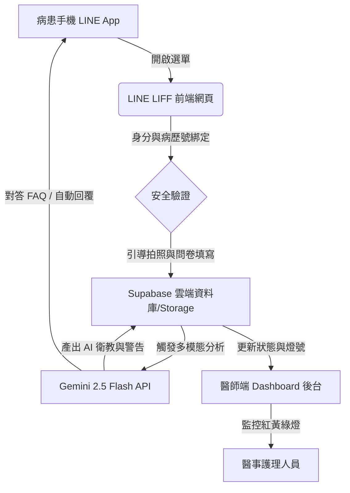

# 🏥 指甲矯正智能追蹤衛教系統開發 (NailTrace AI)
## 專案管理與技術架構文檔 (`project.md`)

本專案為 **台北市立萬芳醫院 115 年度全人計畫 (創新研發組)** 的核心系統開發項目。旨在開發一套「指甲矯正智能追蹤衛教系統」，藉由 LINE 官方帳號 (LIFF) 收集病患端結構化資料，並利用 **Google Gemini AI 多模態模型** 進行即時影像分析與三色預警分流，減輕醫療團隊隨訪負擔，提高照護品質。

---

## 📌 專案基本資料
* **計畫名稱**：指甲矯正智能追蹤衛教系統開發
* **計畫期程**：115 年 08 月 01 日 - 116 年 07 月 31 日 (12 個月)
* **計畫主持人**：萬芳醫院 皮膚科 黃愉真 主任
* **開發團隊**：系統外包工程團隊

---

## 🛠️ 技術系統架構
本專案採用現代化、高效且高隱私性的技術堆疊進行開發：



### 1. 技術堆疊 (Tech Stack)
* **前端框架**：Vue 3 (SFC `<script setup>`) + Vite
* **樣式設計**：Vanilla CSS（深色科技感主題、磨砂玻璃質感面板、流線型動畫）
* **後端與資料庫**：Supabase (提供雲端資料庫儲存及實體 Storage 存放指甲相片)
* **人工智慧**：Google Gemini 2.5 Flash (用於處理多模態腳趾影像識別及自然語言衛教問答)
* **模擬環境**：內建 LocalStorage Fallback 與 4 種內建臨床案例模擬（免 API 金鑰即可演示 MVP）

### 2. 模組化元件清單 (`src/components/`)
* **`LineChat.vue`**：模擬 LINE 行動端對話框，實作 AI 常見問答回覆與 Flex 追蹤報告卡片。
* **`LiffForm.vue`**：模擬 LINE 內嵌 LIFF 表單，包含結構化問卷（VAS 疼痛評分、滿意度等）及**相機半透明輪廓引導拍照模組**。
* **`DoctorConsole.vue`**：醫師端儀表板主協調器，統一接收與分配狀態。
  * **`console/PatientSidebar.vue`**：子模組，管理患者列表及設定面板（API 金鑰儲存、重置資料庫）。
  * **`console/PatientRecordCard.vue`**：子模組，渲染單次追蹤記錄（含痛感圖表、照片分割排版、AI 診斷標籤及衛教建議）。
* **`DatabaseViewer.vue`**：資料庫視覺化檢視器，方便開發階段即時查看 Supabase/LocalStorage 資料變更。
* **`PresentationSlides.vue`**：專案時程簡報模組，包含**5分鐘倒數演練計時器**與 12 個月時程甘特圖，便於黃主任向院方報告。

---

## 🗄️ 資料庫欄位設計 (Database Schema)
專案核心資料表 DDL 已寫入 `supabase-schema.sql`，主要包含以下兩張表：

### 1. `profiles` (患者個人資料表)
| 欄位名稱 | 型態 | 說明 |
| :--- | :--- | :--- |
| `id` | uuid (PK) | 使用者唯一識別碼 (預設自動生成) |
| `line_user_id` | text (Unique) | 病患的 LINE 帳號識別碼 (UID) |
| `patient_id` | text (Unique) | 萬芳醫院病歷號 |
| `name` | text | 病患姓名 |
| `doctor_name` | text | 主治醫師姓名 |
| `status` | text | 當前分流燈號狀態 (`green`, `yellow`, `red`) |
| `created_at` | timestamp | 帳號綁定時間 |

### 2. `tracking_records` (歷次隨訪記錄表)
| 欄位名稱 | 型態 | 說明 |
| :--- | :--- | :--- |
| `id` | uuid (PK) | 紀錄唯一識別碼 |
| `patient_id` | uuid (FK) | 關聯至 `profiles.id` |
| `tracking_month` | integer | 當前追蹤月份 (如：第 1, 3, 6 個月) |
| `pain_score` | integer | VAS 疼痛視覺模擬評分 (0-10 分) |
| `satisfaction_score`| integer | 病患矯正滿意度評分 (0-10 分) |
| `image_url` | text | 上傳的照片路徑（若有多張照則以 `|` 符號分割） |
| `gemini_analysis` | jsonb | 儲存 Gemini API 傳回的結構化診斷結果 (詳細欄位如下) |
| `status` | text | 當次評估燈號 (`green`, `yellow`, `red`) |
| `created_at` | timestamp | 填寫提交時間 |

> **`gemini_analysis` JSON 內存結構**：
> ```json
> {
>   "orthosis_status": "normal" | "loose" | "detached", // 矯正器狀態
>   "inflammation": true | false,                     // 是否發炎
>   "granuloma": true | false,                        // 是否有肉芽
>   "redness_severity": "none" | "mild" | "severe",   // 紅腫嚴重度
>   "patient_advice": "給病患的有溫度中文衛教建議...",
>   "doctor_alert": "給醫護後台的臨床風險警告..."
> }
> ```

---

## 📅 計畫開發時程與里程碑 (12個月)
專案整體期程分為五大階段，預計於第 8 個月進入雙科小規模門診試用階段：

```
M1-M3: [奠基期] 系統分析 (SD) ➔ 🚩 M3 規格書簽認定案
M2-M4: [前端開發期] LIFF 介面與相機引導框實作
M2-M6: [AI訓練期] Gemini API 提示工程訓練 ➔ 🚩 M6 FAQ 成功率達 90%
M7-M8: [後台整合期] 醫生 Dashboard 與三色預警判定 ➔ 🚩 M8 系統測試上線
M9-M12: [驗證期] 門診試用招募 (50例) 與 Bug 修正 ➔ 🚩 M12 原始碼移交
```

* **醫療團隊（黃主任端）配合時程**：
  * **M1 - M2**：提供臨床問卷題目結構、常見患者疑問 (FAQ) 30-50 條、正確拍照示意相片。
  * **M4 - M6**：協助測試並校正 Gemini AI 回覆之專業醫學語意，防止幻覺。
  * **M9 - M11**：於門診引入指甲矯正患者進行系統試用與問卷回傳。

---

## 🏃 如何在本地運行此 MVP 專案

### 1. 基礎安裝
確保本地已安裝 [Node.js](https://nodejs.org/)。於專案目錄下執行：
```bash
# 安裝所有依賴套件 (Vite, Vue, Supabase JS client)
npm install

# 啟動本地開發伺服器
npm run dev
```
瀏覽器打開控制台輸出的 URL (預設為 `http://localhost:5173`) 即可開始使用。

### 2. Gemini API 金鑰配置
本系統內建 **雙模式運行**：
* **演示模式 (無 Key 運行)**：系統會自動模擬 4 種臨床狀況（健康、鬆脫、輕微發炎、肉芽紅腫）的影像診斷結果。
* **真實 AI 模式**：請點擊右側醫師 Dashboard 下方的「**⚙️ 模擬器設定面板**」，貼入您的 Google Gemini API Key。系統即會切換為真實模式，調用多模態視覺模型來即時分析您自訂上傳的照片並產生診斷。

### 3. Supabase 連線設定 (選用)
如需由 Mock 本地儲存切換至真實 Supabase 雲端資料庫：
1. 請參照 `supabase-schema.sql` 於您的 Supabase 專案中執行 DDL 以建立資料表。
2. 在 `supabase-schema.sql` 建立 Policy 與 Storage Bucket (`nail-photos`)。
3. 建立專案目錄下的 `.env.local` 檔案並填入您的金鑰：
   ```env
   VITE_SUPABASE_URL=您的Supabase專案URL
   VITE_SUPABASE_ANON_KEY=您的Supabase公開匿名金鑰
   VITE_GEMINI_API_KEY=您的GeminiAPI金鑰 (選填，亦可在網頁後台手動輸入)
   ```

---

## 📊 簡報與報告資源
* **實體 PowerPoint 報告**：[指甲矯正智能追蹤系統_計畫時程報告.pptx](file:///C:/Users/User/.gemini/antigravity/scratch/nailtrace-ai/指甲矯正智能追蹤系統_計畫時程報告.pptx) (16:9 寬螢幕，適合直接向黃主任或院方投影匯報)。
* **簡報逐字稿與溝通策略**：[project_timeline_presentation.md](file:///C:/Users/User/.gemini/antigravity-cli/brain/0bc122cc-7443-434d-b692-d69f8a400bf3/project_timeline_presentation.md) (包含 5 分鐘完整口述逐字稿與主任溝通技巧)。
